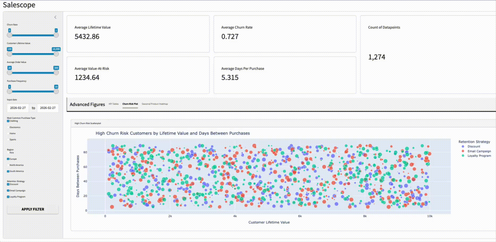

# DSCI-532_2026_10_Salescope

## Overview

Salescope is an interactive dashboard that helps e-commerce businesses understand their customers better and reduce churn. Regional sales directors can compare performance across different territories, while customer success managers can identify at-risk customers and evaluate which retention strategies work best. The dashboard visualizes purchasing patterns by product category, season, and customer segment to support data-driven decisions about inventory planning and marketing campaigns.

## Deployments

A stable deployment from the `main` branch can be viewed at [https://019c8d13-5610-dd58-6134-331453179c0e.share.connect.posit.cloud](https://019c8d13-5610-dd58-6134-331453179c0e.share.connect.posit.cloud)

An updating deployment from the `dev` branch can be viewed at [https://019c8d16-a100-6bb9-8eb5-58c6097addfa.share.connect.posit.cloud](https://019c8d16-a100-6bb9-8eb5-58c6097addfa.share.connect.posit.cloud)

## Dataset

We use the [Sales and Customer Insights](https://www.kaggle.com/datasets/imranalishahh/sales-and-customer-insights) dataset from Kaggle, which contains 10,000 customer records with purchasing behavior and engagement metrics. Below is a description of each column in our dataset:

| Column name  | type | Description | Range of Values |
| ------------- | ------------- | -------------- | ----------------- |
| Customer_ID  | `str`  |  Unique customer identifier| - | 
| Product_ID  | `str`  | Product identifier| - |
| Transaction_ID  | `str`  | Transaction identifier| - |
| Purchase_Frequency  | `int`  | Number of purchases in the review period | `min = 1, max = 19` |
| Average_Order_Value | `float` | Average transaction value in USD| `min = 20, max = 200`| 
| Most_Frequent_Category | `str` | Product type most frequently purchased | `[Clothing, Electronics, Home, Sports]` |
| Time_Between_Purchases | `int` | Average number of days between purchases | `min = 5, max = 89` |
| Region | `str` | Region the customer is located in | `[Asia, Europe, North America, South America]` |
| Churn_Probability | `float` | Probability of the customer leaving | `min = 0, max = 1`|
| Lifetime_Value | `float`  | Predicted total customer revenue in USD | `min = 100, max = 10000`|
| Launch_Date | `date` |  Customer acquisition date | `min = 2019-12-31, max = 2023-01-01` |
| Peak_Sales_Date | `date` |  Date of highest purchase activity | `min = 2022-12-31, max = 2024-01-01` |
| Season | `str` | Season with most sales | `[Spring, Summer, Fall, Winter]` |
| Preferred_Purchase_Times | `str` | Most common time the customer makes purchases | `[Morning, Afternoon, Evening]` |
| Retention_Strategy | `str` | Strategy used for retaining the customer | `[Discount, Email Campaign, Loyalty Program]` |
| Value_At_Risk | `float` | Customer revenue at risk computed by Lifetime_Value × Churn_Probability | `min = 0, max = 10000` |

## Team

This dashboard is developed by Group 10 for DSCI 532:
- Alexander Wen ([@alxwen711](https://github.com/alxwen711))
- Tirth Joshi ([@tirthjoship](https://github.com/tirthjoship))
- Songyang Yu ([@Spanorti08](https://github.com/Spanorti08))
- Raghav Gupta ([@raghav9048](https://github.com/raghav9048))

## Demo

### Milestone 2 Demo For Basic Filter Use



### Milestone 3 Demo For AI Filtering


## Using AI Assistant
The **AI Insights** tab provides a natural language interface to your customer data, allowing for rapid exploration without manual slider adjustments.

* **What the AI Tab Does**: It translates human-readable queries into precise data filters.
* **Query Example**: You can enter requests such as "Show data for customers who belong to North America region only".
* **Dynamic Results**: The app instantly generates a preview table and synchronizes all global dashboard plots to reflect the AI-filtered subset.

## **How to Use Querychat**
1.  **Enter Query**: Type your request (e.g., "Show data for customers who belong to North America region only") into the chat box.
2.  **Sync Dashboard**: Go to the **Advanced Figures** tab and enable the **"Use AI filtered data for dashboard"** toggle present in the sidebar.
3.  **Download Results**: You may also download the specific AI-filtered results by clicking the **"Download Filtered Dataframe"** button located within the AI interface.
4.  **Analyze**: View the updated **Churn Risk Plots**, **Seasonal Product Heatmap**, and **KPI tables** to see the live impact on KPIs.

## How to Run Locally

Follow these steps to set up and run the Salescope dashboard on your local machine:

### 1. Clone the Repository

```bash
git clone https://github.com/UBC-MDS/DSCI-532_2026_10_Salescope.git
cd DSCI-532_2026_10_Salescope
```

### 2. Create the Environment

Create a conda environment using the provided `environment.yml` file:

```bash
conda env create -f environment.yml
conda activate Salescope
```

### 3. Set up an Anthropic API key

The **AI Explorer** tab requires an **Anthropic API key**. An API key is required to enable the querychat functionality on your local machine.

* Create a `.env` file in the root of the repository:
    ```bash
    touch .env
    ```

* Add your API key to the file:
    ```text
    ANTHROPIC_API_KEY=your_api_key_here
    ```

### 4. Verify the Data

The dataset is already included in the repository at `data/raw/sales_and_customer_insights.csv`. You can verify it exists by checking:

```bash
ls data/raw/
```

### 5. Testing

This project includes automated tests for both the dashboard logic and the dashboard interface behavior.

### 5.1 Run All Tests

Run all tests from the project root with:

```bash
python -m pytest -v
```

### 5.2 Logic Unit Tests

The logic unit tests verify the core filtering and aggregation functions used by the dashboard.

Run the logic unit tests with:

```bash
python -m pytest tests/logic_tests.py -v
```

### 5.3 Logic Verification Notebook

A supplementary notebook is included to compare expected and actual results for different dashboard filter selections.

notebooks/logic_tests.ipynb

Run all cells in the notebook to inspect representative logic scenarios manually.

### 5.4 Dashboard UI Playwright Tests

The Playwright tests verify key dashboard behaviors such as filter updates, table changes and reset behavior.

Run the Playwright dashboard tests with:

```bash
pytest tests/test_dashboard_playwright.py -v
```


### 6. Run the Dashboard

Start the Shiny dashboard application:

```bash
shiny run --reload --launch-browser src/app.py
```

The dashboard will automatically open in your default web browser. If it does not open automatically, navigate to the URL shown in the terminal (typically `http://127.0.0.1:8000`).

## License

Licensed under the MIT License. See [LICENSE](LICENSE) for details.
