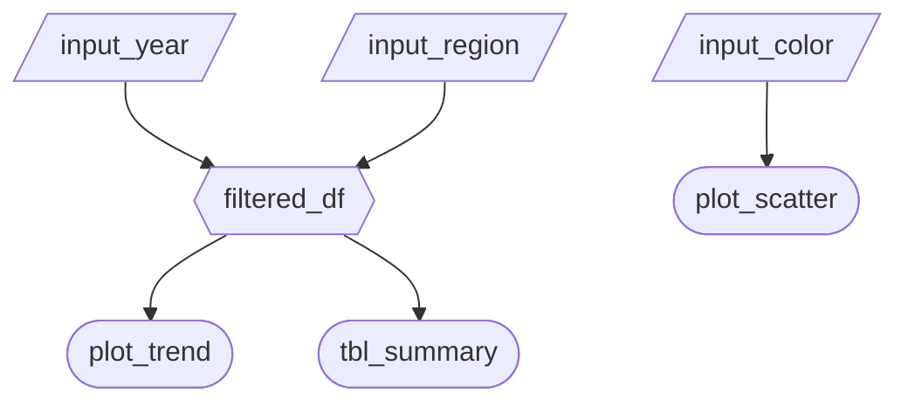

# Salescope Dashboard Specifications


## Section 1: Updated Job Stories

These are the user stories from milestone 1:

> **User Story 1:**
> As a **Regional Sales Director**, I want to **compare basic KPIs (such as mean, median, and maximum) for customer lifetime value, average order value, and purchase frequency across different geographic regions** so that I can **identify high-performing regions to replicate best practices and underperforming regions that need intervention**.
> **User Story 2:**
> As a **Customer Success Manager**, I want to **filter customers by churn probability thresholds and analyze which retention strategies (Loyalty Program, Discount, Email Campaign) are most effective for different risk segments** so that I can **proactively intervene with at-risk customers using the most appropriate retention approach**.
> **User Story 3:**
> As an **E-commerce Product Manager**, I want to **visualize sales patterns across product categories (Electronics, Clothing, Sports, Home) and seasons, including preferred purchase times** so that I can **optimize inventory planning for peak seasons and schedule targeted marketing campaigns during high-conversion periods**. 

And these are the updated job stories and their progress as of Milestone 2:

| #   | Job Story                       | Status         | Notes                         |
| --- | ------------------------------- | -------------- | ----------------------------- |
| 1   | When reviewing annual sales figures, I want to identify high-performing regions, so I can learn what replicate the best practices in these regions to those requiring intervention. | Planned for M2 | Table element is planned for resolving this job story.                              |
| 2   | When investigating abnormal changes in churn rate I want to determine the customers with a high risk of churn so I can infer optimal retention strategies for mitigating this risk. | Planned for M2     |  |
| 3   | When analyzing recent product sales, I want to visualize hidden patterns across product categories, seasons, and purchase times so I can optimize inventory planning for peak seasons and schedule targeted marketing campaigns during high-conversion periods. | Planned for M2  |                               |


## Section 2: Component Inventory

TODO: Replace each row with the components outlined in issues #56, #57, #58, #59

| ID            | Type          | Shiny widget / renderer | Depends on                   | Job story  |
| ------------- | ------------- | ----------------------- | ---------------------------- | ---------- |
| `user-navigation` | Navigation| `ui.navset_bar()`, `ui.navset_panel()` | —             | #1, #2, #3 |
| `component_2` | Reactive calc | `@reactive.calc`        | `input_year`, `input_region` | #1, #2, #3 |
| `component_3` | Output        | `@render.plot`          | `filtered_df`                | #1         |
| `component_4` | Output        | `@render.data_frame`    | `filtered_df`                | #2         |
| `date_filter` | Input         | `ui.input_date_range()` |                              | #1, #2, #3 |
| `component_5` | Input         | `ui.input_slider()`     | —                            | #1, #2     |
| `component_6` | Reactive calc | `@reactive.calc`        | `input_year`, `input_region` | #1, #2, #3 |
| `row_dropdown`| Input         | `ui.input_select()`     | -                            | #1         |
| `customer_df` | Output        | `@render.data_frame`    | `filtered_df`,`row_dropdown` | #1         |
| `risk_df`     | Output        | `@render.data_frame`    | `filtered_df`,`row_dropdown` | #1         |
| `order_df`    | Output        | `@render.data_frame`    | `filtered_df`,`row_dropdown` | #1         |
| `frequency_df`| Output        | `@render.data_frame`    | `filtered_df`,`row_dropdown` | #1         |
| `heatmap_metric`  | Input     |`ui.input_radio_buttons()`| -                           | #3         |
| `heatmap`     | Output        | `@render_widget`        | `filtered_df, heatmap_metric`| #3         |


## Section 3: Reactivity Diagram

Draw your planned reactive graph as a [Mermaid](https://mermaid.js.org/) flowchart using the notation from Lecture 3:

- `[/Input/]` (Parallelogram) (or `[Input]` Rectangle) = reactive input
- Hexagon `{{Name}}` = `@reactive.calc` expression
- Stadium `([Name])` (or Circle) = rendered output

Example:

````markdown

````

## Section 4: Calculation Details

For each `@reactive.calc` in your diagram, briefly describe:

- 1. For Summary Tables (customer_df, risk_df, order_df, frequency_df)

 - Inputs: These four components(customer_df, risk_df, order_df, frequency_df) use the filtered data (filtered_df) & row_dropdown input selected by the user.

 - Transformation: Each output function follows three main steps:

   - Mapping: A dictionary is used to match the user-friendly label from row_dropdown (for eg., "Region") to the actual column name in the dataset.

   - Aggregation: The function calls a shared helper function called create_summary_table.

   - Calculation: The helper function groups the data using .groupby() on the selected column & calculates key statistics- Count (size), Mean, Median, Maximum & Total   (sum) for the specific KPIs.

 - Output: Interactive data table is displayed showing the summarized statistics for the selected metric.


- 2. For Heatmap Output:

  - Inputs: This component uses the filtered data (filtered_df) reactive calculation & heatmap_metric radio button input.

  - Transformation: Server checks what the user selected & runs different calculations:

    - 1. Frequency Count: When the user selects "Frequency", the server counts the number of records using .size(), grouped by "Season" & "Most_Frequent_Category". This shows the total number of transactions.

    - 2. Average LTV: When "Avg Customer Value" is selected, the server calculates the average of the Lifetime_Value column using .mean() for the same groups.

  - Outputs: The result is passed to a Plotly density_heatmap which displays an interactive grid. The chart title updates automatically & colors change based on the selected metric.
