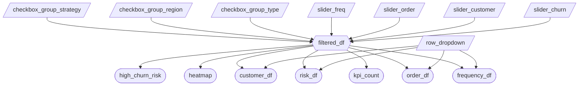

# Salescope Dashboard Specifications


## Section 1: Updated Job Stories

These are the user stories from milestone 1:

> **User Story 1:**
> As a **Regional Sales Director**, I want to **compare basic KPIs (such as mean, median, and maximum) for customer lifetime value, average order value, and purchase frequency across different geographic regions** so that I can **identify high-performing regions to replicate best practices and underperforming regions that need intervention**.
> **User Story 2:**
> As a **Customer Success Manager**, I want to **filter customers by churn probability thresholds and analyze which retention strategies (Loyalty Program, Discount, Email Campaign) are most effective for different risk segments** so that I can **proactively intervene with at-risk customers using the most appropriate retention approach**.
> **User Story 3:**
> As an **E-commerce Product Manager**, I want to **visualize sales patterns across product categories (Electronics, Clothing, Sports, Home) and seasons, including preferred purchase times** so that I can **optimize inventory planning for peak seasons and schedule targeted marketing campaigns during high-conversion periods**. 

And these are the updated job stories and their progress as of Milestone 2:

| #   | Job Story                       | Status         | Notes                         |
| --- | ------------------------------- | -------------- | ----------------------------- |
| 1   | When reviewing annual sales figures, I want to identify high-performing regions, so I can learn what replicate the best practices in these regions to those requiring intervention. | In Progress | Table element is planned for resolving this job story.                              |
| 2   | When investigating abnormal changes in churn rate I want to determine the customers with a high risk of churn so I can infer optimal retention strategies for mitigating this risk. | In Progress     | Scatter plot implementation is under active development. |
| 3   | When analyzing recent product sales, I want to visualize hidden patterns across product categories, seasons, and purchase times so I can optimize inventory planning for peak seasons and schedule targeted marketing campaigns during high-conversion periods. | In Progress  | Heatmap implementation is under active development.                              |


## Section 2: Component Inventory


| ID            | Type          | Shiny widget / renderer | Depends on                   | Job story  |
| ------------- | ------------- | ----------------------- | ---------------------------- | ---------- |
| `user-navigation` | Navigation| `ui.navset_bar()`, `ui.nav_panel()` | —             | #1, #2, #3 |
| `slider_*` | Input            | `ui.input_slider()`        | -                         | #1, #2, #3 |
| `check_box_group_*` | Input   | `ui.input_checkbox_group()` | -                        | #1, #2, #3 |
| `date_range`  | Input         | `ui.input_date_range()`    | -                           | #1, #2, #3 |
| `reset` | Input        | `ui.input_action_button()`   | -                           | #1, #2, #3 |
| `reset` | Reactive Effect     | `@reactive.effect`      | `slider_*`, `check_box_group_*`, `date_range`                | #1, #2, #3 |
| `filtered_df` | Reactive calc | `@reactive.calc`        | `slider_*`, `check_box_group_*`, `date_range` | #1, #2, #3 |
| `high_churn_risk` | Output        | `@render_widget`        | `filtered_df`                | #2         |
| `row_dropdown`    | Input         | `ui.input_select()`     | —                            | #1         |
| `component_4` | Output        | `@render.data_frame`    | `filtered_df`                | #2         |
| `component_5` | Input         | `ui.input_slider()`     | —                            | #1, #2     |
| `component_6` | Reactive calc | `@reactive.calc`        | `input_year`, `input_region` | #1, #2, #3 |
| `customer_df` | Output        | `@render.data_frame`    | `filtered_df`,`row_dropdown` | #1         |
| `risk_df`     | Output        | `@render.data_frame`    | `filtered_df`,`row_dropdown` | #1         |
| `order_df`    | Output        | `@render.data_frame`    | `filtered_df`,`row_dropdown` | #1         |
| `frequency_df`| Output        | `@render.data_frame`    | `filtered_df`,`row_dropdown` | #1         |
| `heatmap_metric`  | Input     |`ui.input_radio_buttons()`| -                           | #3         |
| `heatmap`     | Output        | `@render_widget`        | `filtered_df, heatmap_metric`| #3         |

Rows component_4-8 will be filled per issues #57, #58, #59 as implementation progresses.

Each of the slider and checkbox components are similar to each other and represent the following components:

```
slider_* -> slider_churn, slider_customer, slider_order, slider_freq
check_box_group_* -> check_box_group_type, check_box_group_region, check_box_group_strategy
```

## Section 3: Reactivity Diagram

Draw your planned reactive graph as a [Mermaid](https://mermaid.js.org/) flowchart using the notation from Lecture 3:

- `[/Input/]` (Parallelogram) (or `[Input]` Rectangle) = reactive input
- Hexagon `{{Name}}` = `@reactive.calc` expression
- Stadium `([Name])` (or Circle) = rendered output

Example:

````markdown

````

## Section 4: Calculation Details

### `filtered_df`

- **Inputs:** `slider_churn`, `slider_customer`, `slider_order`, `slider_freq`, `date_range`, `checkbox_group_type`, `checkbox_group_region`, `checkbox_group_strategy`.
- **Transformation:** Starts with a copy of the full 10,000-row dataset and applies sequential filters. Numeric columns (`Churn_Probability`, `Lifetime_Value`, `Average_Order_Value`, `Purchase_Frequency`) are clipped to the selected slider ranges using `.between()`. The `Launch_Date` column is filtered to the selected date range. Categorical columns (`Most_Frequent_Category`, `Region`, `Retention_Strategy`) are then filtered using `.isin()` based on the selected checkbox values. If a checkbox group has nothing selected, that filter is skipped entirely so the app does not return zero rows unexpectedly.
- **Outputs:** `high_churn_risk`, `heatmap`, `customer_df`, `risk_df`, `order_df`, `frequency_df`, `kpi_count`.
